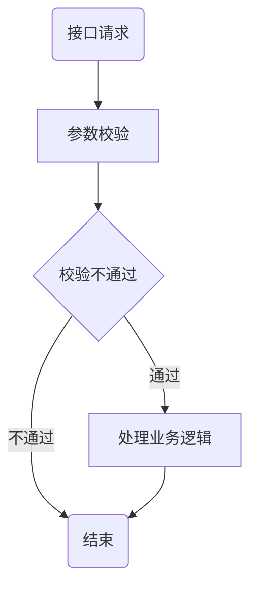
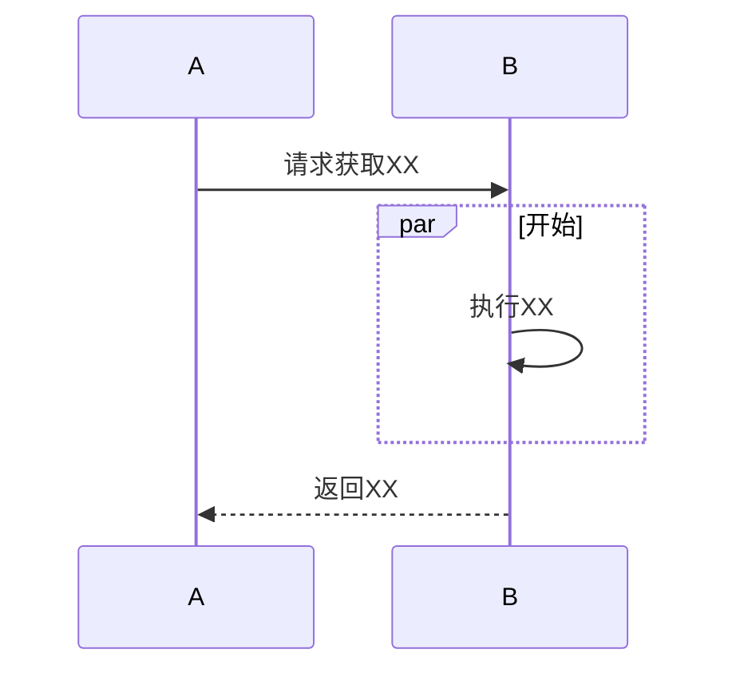

# 文档模板
> By 文档君
## 目标
> 使用比较简洁的语言说明这篇文档要达成的目标，能让读者比较快的辨别自己是否需要去了解这部分知识。如：
- 提供一份大家写文档时可以遵循的通用模板
- 希望大家有了这篇模板以后更愿意写文档
> 同时也需要明确说明这篇文档不能达成的事情。如：
- 这篇模板不能覆盖全部的文档类型，仅是抛砖引玉，告诉大家写文档的宗旨要简洁、清晰

## 背景
> 我们需要描述清楚为什么要做这件事，因为不是每一个人都参与了每一项活动，我们的文档面对的读者范围不只是开发或者测试，而是公司每一个对这件事感兴趣的同事。写文档模板的背景则是希望大家能愿意写文档，以此减少同事之间的沟通成本。如：
- 没有文档积累，我们经常会重复询问开发这个功能的业务流程，或者我们经常会询问测试这个功能当时的结果如何如何，无形之中我们浪费了很多宝贵的时间
- 同时，询问同事这一个看似比较小的动作，可以非常轻松地破坏同事的工作状态，他需要打断自己的工作流然后再花时间去回忆或者去翻代码才能想起，这对我们产品的迭代速度是一个比较大的影响
- 最后就是每一个新入职的同事，对他们来说，也是比较痛苦的，他们没有办法快速的了解我们在做的产品，很难快速融入到我们团队
- 那文档模板的存在就是为了能够给降低大家对于写文档的恐惧，模板都给大家准备了，写这个事情就不会那么抗拒了吧

## 实现
### 总体设计
- 总体设计可以包含一些框架图，业务流程图，方案等
- 总体设计是笔者对于这个事情的理解以后的一个具体化，可以让大家检验他对于需求的理解是否正确
- 使用图的方式可以帮助读者更好地去了解系统及业务
- 流程图

- 时序图

- 更多图表画法可以[点击这里查看](https://github.com/mermaid-js/mermaid)

### 详细设计
- 详细设计可以包含一些数据定义、表结构定义、API定义等，切记不要放上你的代码
- 一定不要在没完成设计之前去写代码
- 详细的模块或者功能说明也可以帮助后来者更好地了解系统及功能实现
> Testing Notes: 表明测试同事需要重点查看  
> Technical Notes：表明开发同事需要重点查看

### 功能说明
- 可以梳理出功能点，帮助不具备coding能力的同学了解相关业务

### 存在问题
- 当我们是在写一份功能文档的时候，在设计之初，就可能有明确的缺陷，但是当下它不影响我们主要的功能推进，我们可以在这里明确写下来，当测试或者其他开发者阅读文档以后，就可以减少大家的迷惑

## 未来计划
- 不同的阶段会有不同的最优解，我们可以展望未来，探讨下一个阶段的优化方案
- 比如在速度，性能，稳定性，成本等不同方面的考量时，有不同的方案实现，以后改进可以起到指导作用

## 参考文档
- 我们可以在这链接一些通用的或者官方的介绍，让大家深入地了解相关领域的知识
